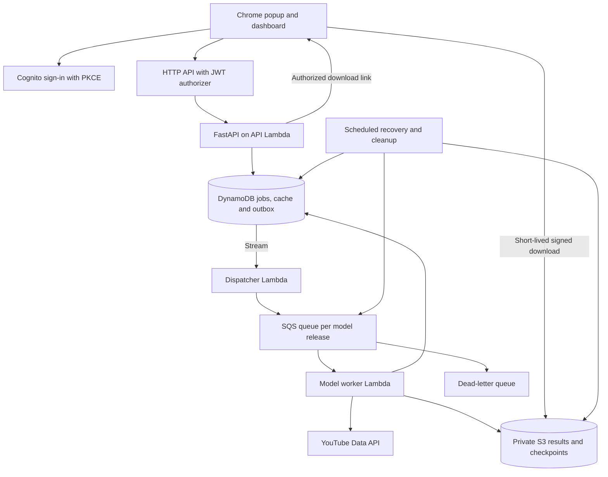
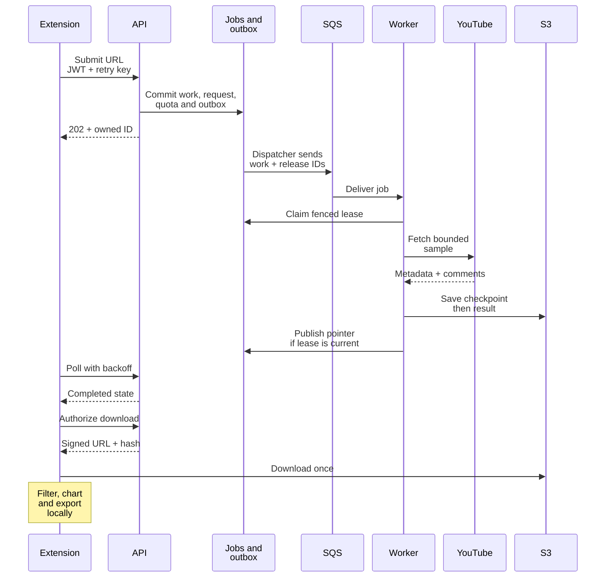
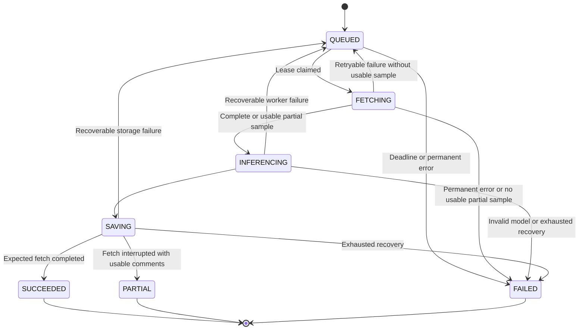

# Serving comment analysis to 1,000 active users

This is the design for the first live release of Comment Lens. The target is
1,000 active users, with a low initial AWS cost and a monthly budget to be
chosen before deployment. It is a design target, not a load-test result.
The backend and AWS resources have not been built by this change.

An active user might read an existing dashboard, wait for a job, or request a
new video. Those activities have very different costs. Reading a downloaded
result needs no model worker. An uncached video needs YouTube requests and one
worker. We will share recent public-video results so a popular video does not
create a separate fetch job for every viewer.

## What V1 will analyze

V1 accepts public YouTube videos and samples up to 1,000 of their latest
top-level comments. It does not fetch replies. The requested limit can be
between 1 and 1,000. Fetching uses `order=time`, `textFormat=plainText`, and
pages of up to 100 items. Video metadata is checked with `videos.list`, including
public visibility. Unlisted/private videos are outside this release's scope.
These are explicit sampling choices; the result does not describe every comment
on the video. The [commentThreads API](https://developers.google.com/youtube/v3/docs/commentThreads/list)
documents pagination and the ordering options.

Read at most `ceil(requested_limit / 100)` comment pages, with the last page's
size bounded by the remaining requested count. Remove duplicate IDs and report
them; do not fetch extra pages to refill a deduplicated sample. This keeps the
page budget predictable even when comments change during pagination.

Every result records the requested limit, fetched count, duplicate count,
analyzed count, skip reasons, whether more comments were available, UTC sample
period, fetch time, and model release. A video's total `commentCount` is a video
statistic, not the denominator for sample sentiment percentages. Charts use
analyzed comments; coverage uses the unique fetched comments passed to the
prediction adapter. Latest comments are a time-ordered sample, not a random
sample of viewers.

**Live YouTube sentiment analysis has a launch prerequisite.** YouTube's current
analytics-use amendment allows comment sentiment analysis for developers
approved for that use. We have not verified that this project has approval.
Live fetching stays disabled until that approval is recorded; backend work and
load tests can use fixtures meanwhile. Model scores must be identified as our
analysis, separate from YouTube's own statistics. See the
[derived-metrics policy](https://developers.google.com/youtube/terms/derived-metrics-policy)
and [developer policies, section III.L](https://developers.google.com/youtube/terms/developer-policies).

## The architecture



The API validates requests, checks ownership, and accepts jobs. It does not
fetch YouTube comments or load the model. The worker does that slower work.
A queue lets us cap worker concurrency while keeping the API available for
people checking their results. AWS documents the SQS/Lambda integration and its
[at-least-once delivery behavior](https://docs.aws.amazon.com/lambda/latest/dg/with-sqs.html).
Duplicate delivery is expected and handled by the job protocol below.

| Part | V1 choice | Reason |
| --- | --- | --- |
| HTTP entry | API Gateway HTTP API | Managed HTTPS, JWT verification, route throttles |
| API runtime | FastAPI + Mangum on Lambda, Python 3.12 | Small stateless API; independent of model execution |
| User identity | Cognito public app client, authorization code + PKCE | User ownership without shipping a client secret |
| Job/cache store | DynamoDB on-demand | Conditional writes and transactions; no database server to keep running |
| Work delivery | Standard SQS, one queue per immutable serving release | Buffer bursts and pin queued work to the correct model |
| Inference | Lambda container, Linux x86_64, model included | Small CPU model, no model download during each job |
| Large data | Private S3 JSON objects | Keep comment text/results outside job records and queue messages |
| Recovery | DynamoDB Streams dispatcher + scheduled reconciler | Recover committed jobs if message publication fails |
| Operations | CloudWatch logs/metrics/alarms, AWS cost alerts | Observe latency, errors, quota consumption and spending |

Use `us-east-1`, matching the existing S3 dataset location. API, queues, workers,
and tables stay in that region. Start without attaching Lambdas to a customer
VPC; they need public YouTube access and managed AWS services. This avoids a
NAT gateway in the initial deployment. AWS explains the default internet access
and the extra networking needed for
[VPC-connected Lambdas](https://docs.aws.amazon.com/lambda/latest/dg/configuration-vpc-internet.html).

Redis, an always-running inference server, and a Kubernetes cluster are not
needed for this model at launch. Revisit ECS/Fargate when measured steady load,
startup latency, or longer jobs make it economical. That migration can keep
the HTTP contract, job records, SQS queues, and S3 result format.

## From a click to a dashboard

The sequence groups the job store and its outbox dispatcher to keep the main
request flow readable; the architecture above shows them separately.



On a completed cache hit the API returns `200` with a new owned analysis ID;
there is no new worker or quota reservation. On an identical running job it
creates an owned reference and returns `202`. Never expose a work record or
another user's request ID as the public analysis ID.

Poll after 2 seconds, then 5, then 10, adding jitter. Pause while the tab is
hidden and stop at a terminal state. Two jobs per user remain within the
steady per-user read limit at this cadence. After completion, download the JSON
once and perform table search, filtering, pagination, charts, and CSV export
in the extension. Renew an expired download link through the authenticated API.

## Capacity and response goals

These numbers are starting settings to test, not measured AWS throughput.
The design separates the user target from the admission rate for new work.

| Workload | Initial design target or limit |
| --- | --- |
| Active users | 1,000 |
| Status traffic | 100 requests/s at 10-second polling; test a 200 requests/s burst |
| HTTP API throttle | 300 requests/s, burst 600; POST route 20/s, burst 40 |
| API Lambda | 512 MiB, 10-second timeout, reserved concurrency 100 |
| New distinct uncached jobs | Healthy target 6/min; admission cap 10/min |
| Submission burst | Test 30 distinct videos together; admit at most 10/min and reject excess; maximum 200 nonterminal work records |
| Per user | 3 submissions/min, 30 reads/min, at most 2 active analysis references |
| Worker | 2,048 MiB, 180-second timeout, native thread limit 1 |
| Worker concurrency | At most 10 across active release queues |
| SQS mapping | Batch size 1, batch window 0, partial batch failure reporting |
| SQS visibility | 1,080 seconds; maximum receives 5, then DLQ |
| Overall job deadline | 30 minutes from acceptance, including queueing/retries |
| Warm API goal | p95 at most 500 ms under the target load |
| Normal completed cache-hit goal | At most 2 seconds for the API response |
| Healthy new-job goal | p95 at most 90 seconds with queue wait at most 30 seconds |

The latency goals must be checked from the intended users' locations as well
as within AWS. Report cold starts, burst queueing, and upstream failures
separately; they cannot be hidden inside a healthy-path average. Admission
returns a clear busy/quota response when capacity is exhausted.

For sizing, let `lambda` be new jobs per second, `S` their mean worker duration,
and `u` desired utilization. A useful first estimate is
`workers >= ceil(lambda * S / u)`. At 6 jobs/min, an **assumed** 45-second mean
duration, and 70% utilization, this gives 7 workers. Ten leaves some headroom.
Ten jobs/min sustained at that duration would require 11 workers at the same
utilization, so the 10/min admission cap is a short-burst allowance rather
than a sustainable throughput promise. Replace the assumed duration after
fixture and real upstream measurements.

Lambda allocates CPU in proportion to memory; around 1,769 MiB corresponds to
one vCPU. The proposed 2,048 MiB worker is a starting point for a benchmark,
not a requirement inferred from the model file size.
[AWS memory guidance](https://docs.aws.amazon.com/lambda/latest/dg/configuration-memory.html)
explains this relationship. Configure SQS maximum concurrency and worker
reserved concurrency together: during release overlap their sum must fit 10.
See [SQS scaling](https://docs.aws.amazon.com/lambda/latest/dg/services-sqs-scaling.html).
The visibility setting follows AWS's recommendation of at least six times the
function timeout plus the batch window.
[SQS configuration](https://docs.aws.amazon.com/lambda/latest/dg/services-sqs-configure.html)

### What we have actually measured

The current model is 2,323,682 bytes. A local sequential benchmark of the first
1,000 raw comments, repeated 20 times after one warmup, measured a median of
35.4 ms and a nearest-rank p95 of 43.4 ms per batch of 1,000. Model initialization
took 0.83 seconds excluding imports; process RSS after the runs was about
200 MiB, not a peak-memory measurement. The machine had 24 logical CPUs and
the existing service used four native threads.

This excludes AWS startup, networking, authentication, fetching, queues, and
storage. It supports trying CPU inference; it does not prove 1,000-user capacity.
The aggregate measurements and limitations are in
[local_inference_benchmark.json](../reports/local_inference_benchmark.json).
Reproduce the measurement with:

```powershell
.\.venv\Scripts\python.exe scripts/benchmark_inference.py
```

The script requires existing local data and model files and does not pull DVC
or contact AWS. Different machines/runs will produce different measurements.

## YouTube quota is a separate capacity limit

The current default daily allocation for the API endpoints used here is
10,000 units. `videos.list` and each `commentThreads.list` page cost one unit.
The actual project's quota must be checked in Google Cloud before launch;
10,000 is an example configuration, not a verified entitlement. YouTube resets
daily quota at midnight Pacific time. See the
[quota calculation](https://developers.google.com/youtube/v3/determine_quota_cost)
and [video metadata endpoint](https://developers.google.com/youtube/v3/docs/videos/list).

Budget 80% of that example allocation, or 8,000 units/day, for this application.
One full 1,000-comment sample normally costs 1 metadata call + 10 pages = 11
units. That permits about `floor(8000 / 11) = 727` such fresh analyses/day before
retries or other project usage. One thousand people each requesting a different
full video in a day would exceed the default quota. Worker autoscaling cannot
solve that. Cache hits and shorter videos use fewer units; a quota increase
requires the proper approval process.

At new-work admission, reserve up to 33 units: eleven calls with a maximum of
three HTTP attempts per call. A transaction checks that spent units plus all
outstanding reservations remain within the daily working budget. Each attempted
request transfers one unit from reserved to spent **before** making the call;
a network failure still consumes that allowance. Successful pages are
checkpointed so a retry resumes rather than starting from page one. Invocation
retries share the original remaining reservation; they do not get another 33
units for free. If recovery needs an extra call, it must acquire a new unit
through the same global budget check or stop with a partial/failed outcome.

Release unused reservations exactly once at terminal completion or expiry.
Never refund attempted calls. A global five-attempts/second limiter smooths
upstream traffic across workers. Midnight handling uses
`America/Los_Angeles`, including daylight-saving changes: move a job's remaining
reservation to the new day's counter atomically before its next call, or stop
when the new day cannot reserve it. Other clients sharing the Google project
need an allocated allowance too; monitor actual Google quota usage.

## Cache keys, ownership, and durable jobs

The cache fingerprint includes canonical video ID, public-data scope, requested
comment limit, ordering, reply policy, and **serving release ID**. A serving
release binds model SHA-256, preprocessing fingerprint, inference code version,
review threshold, and response schema. Changing a threshold or adapter must
not reuse a result from incompatible code even if the model file is unchanged.

Completed results are fresh for 15 minutes. Running work can be joined only
before its deadline and under the same release. There is no force-refresh
button in V1. Expired cache pointers are replaced using a conditional write;
old owned references keep their original work/result until retention expiry.
Cache sharing applies only to public videos. If private/channel-authorized data
is introduced later, tenant and authorization scope must become part of every
key and permission check.

Use one DynamoDB table with these item families. Large comment text stays in S3.

| Key family | Stored information |
| --- | --- |
| `WORK#id` | State, input parameters, release, progress, attempt/lease token, deadline, result pointer/hash, remaining quota reservation, terminal-release flag |
| `REQUEST#id` | Cognito owner subject, work ID, creation/expiry; this ID is public to its owner |
| `CACHE#fingerprint` | Current work ID, freshness deadline, conditional-write version |
| `IDEMP#owner#key` | Canonical body hash and original request ID, retained 24 hours |
| `OUTBOX#work#dispatch-generation` | Pending/sent message, queue release, retry timestamps; no comments |
| `QUOTA#Pacific-date` | Configured daily budget, spent units, outstanding reservations |
| `LIMIT#scope#window` | User/global rate counters and active-slot references |
| `MODEL#release`, `MODEL#CURRENT` | Immutable release manifest and current-release pointer |

Use due-time indexes for pending outbox, expired work leases, and cleanup, plus
an owner index for request deletion. Index reads can be eventually consistent;
every action is confirmed by a conditional write on the base item. Never use a
table-wide scan for each poll or fetch attempt. Check expiry in application
code: [DynamoDB TTL deletion is asynchronous](https://docs.aws.amazon.com/amazondynamodb/latest/developerguide/TTL.html)
and is not a freshness check or a lock.

For a cache miss, a single transaction creates the work, owned request,
idempotency record, cache claim, quota reservation, active slots, and outbox.
On contention, re-read and join the winning work. Cached/running joins create
only their owned reference and idempotency/slot records as appropriate.
Reusing an idempotency key with another body returns `409`; replaying the same
body returns the original analysis ID. This relies on
[DynamoDB conditional transactions](https://docs.aws.amazon.com/amazondynamodb/latest/developerguide/transaction-apis.html).

The dispatcher sends an outbox message to SQS, then marks it sent. Crashing
between those operations creates a duplicate, which is safe. Committing the
work and then losing stream delivery must not lose the job: a scheduled
reconciler republishes pending outbox records older than 30 seconds. Streams
are a delivery trigger, not the durable outbox itself; their retention is
limited. [DynamoDB Streams with Lambda](https://docs.aws.amazon.com/amazondynamodb/latest/developerguide/Streams.Lambda.html)

## Worker ownership and failure handling

A worker claims a nonterminal job with a conditional update, increments a
fencing token, and leases it for 210 seconds. It verifies the job's release
against its own image before fetching. Heartbeats/progress updates extend the
lease about every 30 seconds. Check deadline/ownership before each external
call and each checkpoint. A duplicate with an active lease performs no work;
scheduled recovery re-enqueues a job whose lease has expired, using a new
dispatch generation, so acknowledgement of a duplicate cannot lose recovery.



Retry/resume transitions retain the checkpoint and bounded attempt counters.
Reaching the requested sample limit is normal `SUCCEEDED` with `has_more=true`,
not `PARTIAL`. An interruption after some valid comments can produce `PARTIAL`
with a reason. A video with zero comments succeeds with an empty result.
Comments-disabled, missing-video, or nonpublic-video errors fail explicitly.

Use bounded HTTP timeouts and exponential backoff with jitter for network,
429, and 5xx errors. Allow at most three HTTP attempts per logical fetch call,
subject to the shared quota reservation. Invalid credentials and quota errors
open a global fetch circuit and alert operators. Do not retry permanent 403/404
video errors as transient failures. Start wrapping up an attempt at 150 seconds
so the worker can checkpoint and return before its 180-second timeout.
A timeout may delay SQS redelivery for 18 minutes; the 30-minute overall deadline
bounds the wait. Recovery must never reset that deadline. Redrive from the DLQ
is an operator action after checking the cause and the remaining job deadline.

S3 checkpoint/result keys include the work ID and lease token. Upload an
immutable object before publishing its pointer. The final DynamoDB update must
match the current fencing token, state, and deadline. A stale worker cannot
replace a newer result or release quota/active slots a second time. Orphaned
attempt objects are cleaned later. An S3 upload alone never marks a job complete.

Per-user active slots are short references to owned analysis IDs. Terminal or
expired references are reclaimed conditionally when admitting the next request;
completion of a shared popular job does not need a transaction updating every
viewer. The global nonterminal-work counter is released exactly once with the
work's terminal transition.

## Serving the trained model safely

Reuse [PredictionService](prediction.md) and its saved normalization recipe.
Do not build another tokenizer in the HTTP API or normalize text twice.
Each warm worker environment keeps one service instance; no fitting, DVC pull,
MLflow server request, or raw training CSV is part of serving.

The current bundle verifies its training report, SHA-256, label mapping,
preprocessing, and exact package versions before use. Keep those checks.
Only deserialize a bundle built by the trusted project pipeline. Bake that
bundle and training report into an immutable worker image; `restore_with_dvc`
must be false in production. The present package versions need validation in a
Linux Python 3.12 image using golden prediction cases before deployment.

One backend prerequisite is a runtime native-thread limit override in the
shared service. Today it explicitly uses the training report's value, four.
Setting `OMP_NUM_THREADS=1` alone does not override that call. Add a tested
serving setting of one, leaving the training configuration and saved model
unchanged. Start with batches of 256 and a 0.6 review threshold.

The adapter joins ordered predictions to comment IDs, display names, likes,
and publish times. Drop repeated comment IDs before inference. Reject/skip text
above 5,000 Unicode characters with `text_too_long`; do not silently truncate
it. Retain a metadata placeholder and its skip reason, without the oversized
raw text. Preserve the existing `empty_text` and `no_known_features` skips.
Enforce a 10 MiB serialized result ceiling. If it would be exceeded, fail with
`RESULT_TOO_LARGE` rather than publish a truncated file or inconsistent counts.
All counters must reconcile to the unique fetched sample.

The response's highest class score is a confidence indicator, not a calibrated
probability that the label is correct. Test accuracy is 71.59% and macro F1 is
71.69% on the supplied labels. Human confirmation of the reviewed labels is
still pending. Neither those scores nor the local benchmark establish live
YouTube accuracy. Preserve these qualifications in model details.

## HTTP and result contracts

The proposed [OpenAPI contract](backend-contract.yaml) defines the endpoints and
JSON shapes. It is a specification, not a running API.

| Route | Purpose |
| --- | --- |
| `POST /v1/analyses` | Accept a validated URL and comment limit; idempotency key required |
| `GET /v1/analyses/{analysis_id}` | Read an owned job's state, progress, sampling scope and release |
| `GET /v1/analyses/{analysis_id}/result` | Get an authorized signed download descriptor for terminal results |
| `DELETE /v1/analyses/{analysis_id}` | Remove the owner's reference; do not cancel shared work used by others |
| `GET /v1/models/current` | Explain the current release and evaluation limitations |
| `GET /health/live` | Small public liveness response with no credentials or internal paths |

Every `/v1` route requires a Cognito access token with the appropriate scope.
Unknown and foreign analysis IDs both return `404`. Expired owned requests
return `410` until cleanup, then `404`. Download links last at most five minutes
and never beyond result expiry. The API reads only authorized S3 pointers, not
an arbitrary bucket/key supplied by a client. Result JSON is downloaded directly
from S3 so the API does not repeatedly proxy large comment payloads.

All errors use one envelope with a stable code, safe message, retryability,
and request ID. Distinguish invalid URLs (`422`), user/rate limits (`429`), busy
queues (`503`), daily quota exhaustion (`503` with reset time), and disabled
live analysis (`503`). Gateway-generated authentication/throttle failures may
use the gateway's native error body; the extension handles that fallback too.
Never return stack traces, keys, raw provider error bodies, or signed URLs in logs.

## Authentication, storage, and retention

Use [Cognito authorization code with PKCE](https://docs.aws.amazon.com/cognito/latest/developerguide/using-pkce-in-authorization-code.html)
and [chrome.identity.launchWebAuthFlow](https://developer.chrome.com/docs/extensions/reference/api/identity).
Register the stable extension ID's Chromium redirect URL, validate OAuth state,
and use S256. The extension is a public client without a client secret. Store
session tokens in extension session storage, restrict access to trusted extension
contexts, and start interactive sign-in only from a user action. API Gateway
validates issuer, audience/client ID, expiry and route scopes through its
[JWT authorizer](https://docs.aws.amazon.com/apigateway/latest/developerguide/http-api-jwt-authorizer.html).
This login identifies our users; it does not grant access to private YouTube data.

When connecting the extension, add only `identity`, `storage`, and the exact API,
Cognito token endpoint and signed-S3-download origins needed. Keep locally
packaged JavaScript and the existing restrictive CSP. CORS explicitly allows
the published extension origin and configured development origins; it does not
replace authorization. Validate video IDs and construct fixed Google API URLs
server-side rather than fetching user-supplied URLs.

Keep YouTube credentials in Secrets Manager and use Lambda execution roles for
AWS access. CI uses GitHub OIDC with a scoped deployment role. No static AWS
keys or YouTube key goes into the extension, Git, model image, or API response.

Keep serving objects under `serving/<environment>/...`, separate from
`datasets/youtube-comments`. The existing DVC policy grants access only to the
dataset prefix; it does not authorize serving storage. Deployment will create
separate least-privilege API, dispatcher, worker, and cleanup roles. The worker
writes serving/checkpoint objects; the API can sign result reads; neither needs
write access to training data. S3 stays private with public access blocked,
encryption, TLS, and an explicit download CORS rule.

Retain fetched comment checkpoints and results for 24 hours. Expiry is checked
on every API read and before issuing download links. A scheduled cleanup removes
expired API data/objects; a seven-day S3 lifecycle backstop removes missed and
orphaned objects. Model artifacts contain no live API comments and have a
separate versioned release lifecycle. Logs retain 14 days and exclude comment
text, author names, tokens, and credentials. A request deletion removes its
owned history/reference; shared public results remain subject to the same
short retention. The UI explains this behavior. Administrative deletion of a
video's cached source data invalidates all its pointers and removes its objects.
Previously issued signed download links can remain valid for up to five minutes;
deleting an owned reference prevents issuing new ones.
The short retention leaves margin under YouTube's API-data refresh/delete rule;
do not extend it implicitly when adding history features.

## Model releases and rollback

1. Training/evaluation and DVC/MLflow synchronization finish in the existing
   offline pipeline. A candidate manifest identifies exact artifact/report hashes.
2. CI downloads only the selected trusted model and reports, verifies them,
   builds a pinned Linux image, and runs golden cases against PredictionService.
3. Publish an immutable release manifest, worker version/image digest, and its
   own SQS queue. Smoke-test that release without changing `MODEL#CURRENT`.
4. Atomically change the current pointer. New work uses the new release queue;
   accepted old work retains its original release. Split the concurrency cap,
   for example old 2 + new 8, while both queues drain.
5. Roll back by selecting an already tested release with its queue/worker still
   available. A mismatched worker must fail closed, never use the wrong model.
   Retire old consumers only after their jobs have drained or expired. Existing
   completed results remain readable for their 24-hour retention.

MLflow remains the experiment record. The local SQLite tracking database is
not a concurrent production dependency. Dataset DVC objects are not copied into
the API image. Infrastructure is versioned as AWS CDK Python in the backend
phase; development and production have separate resource names, prefixes,
identities, keys, and quotas.

## Costs and operational limits

There is no approved monthly budget yet. Use these formulas to choose it after
the AWS load test. In us-east-1, the published starting HTTP API rate is $1 per
million requests; the standard first-tier x86 Lambda examples use
$0.0000166667 per GB-second and $0.20 per million requests. Verify rates when
deploying. [API Gateway pricing](https://aws.amazon.com/api-gateway/pricing/),
[Lambda pricing](https://aws.amazon.com/lambda/pricing/).

| Illustrative usage, before credits | Partial monthly cost |
| --- | --- |
| 1,000 pending viewers polling every 10 seconds for 1 hour/day, 30 days: 10.8M HTTP calls | HTTP API about $10.80 |
| Same calls, API at 0.5 GiB and assumed mean 50 ms | Lambda compute about $4.50 + requests $2.16 |
| 500 new jobs/day, 30 days, worker at 2 GiB and assumed mean 30 seconds | Lambda compute about $15.00 + requests $0.003 |

These are partial examples, not a total AWS bill or a promised job duration.
They exclude DynamoDB reads/transactions, SQS, dispatcher/recovery invocations,
S3 requests/storage/downloads, Cognito, Secrets Manager, ECR, logs, taxes and
other services. The polling example is deliberately heavy: a finished dashboard
stops polling. Real cost depends on cache misses and upstream duration as well
as users. Do not assume promotional credits or free tiers.

Apply admission limits, worker concurrency caps, a daily YouTube allowance,
bounded result sizes and retention before launch. Budget alerts notify us;
they do not impose a hard billing stop. Set the actual monthly budget and alarm
thresholds before any production deployment. Record measured cost per fresh
analysis and per 1,000 status reads so we can tune the design with evidence.

Track API latency/errors/throttles, cache hit ratio, queue age, job completion
time, worker duration/memory/cold starts, lease conflicts, DLQ messages,
spent/reserved YouTube units, result sizes, and unknown-feature/skip ratios.
Include release ID and work/request IDs in structured logs without comment text.
Alert on DLQ messages, model-integrity failure, worker throttles, and sustained
queue age above 60 seconds; tune error-rate alarms with a minimum sample size.
Provider outages should show an explicit unavailable/partial state while
existing valid results remain readable. No live-accuracy metric is reported
without new verified labels.

## What must pass before release

- [ ] 1,000 fixture users: 100 status reads/s for 15 minutes, 200/s burst,
  ownership checks intact, and warm API latency within the stated goal.
- [ ] 1,000 submissions for one video: one canonical work item/reservation,
  isolated owned references, and one fetch sequence despite duplicate messages.
- [ ] 30 distinct-video burst plus 6/min arrivals: bounded worker concurrency,
  measured queue/completion times, fair busy responses and no event-loop blocking.
- [ ] Crash after database commit, after SQS send, after checkpoint upload, and
  after result upload: recovery eventually completes or fails explicitly.
- [ ] Expired lease/stale worker: cannot publish results or release counters twice.
- [ ] Quota reservation/retries/Pacific DST rollover: no HTTP attempt without an
  allowance; daily spent plus reservations never exceeds the working budget.
- [ ] Private/unlisted/disabled-comment/empty videos, invalid URLs, unknown words,
  oversized comments, and provider 429/5xx failures have honest dashboard states.
- [ ] Cross-owner access is rejected; expired data/downloads are not served;
  cleanup removes live comment data and does not delete model artifacts.
- [ ] Linux image passes hash/version/preprocessing/golden-prediction checks;
  release change and rollback preserve queued work's model version.
- [ ] YouTube analytics-use approval, real Google quota, AWS service quotas,
  extension ID/auth redirect, and a monthly budget are recorded before live launch.

The implementation order and commit boundaries are in
[backend-plan.md](backend-plan.md). The proposed settings are in
[serving-settings.example.yaml](serving-settings.example.yaml). Neither file is
loaded by the training pipeline or changes its DVC dependencies.
